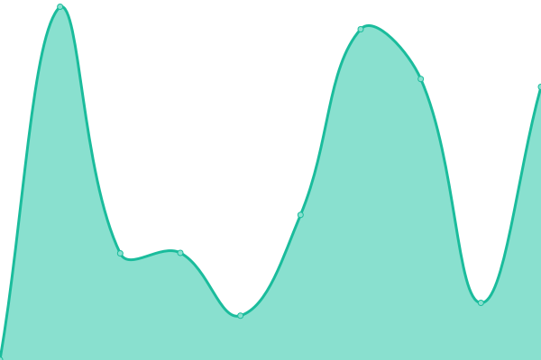

# [📈 Live Status](https://jbowdre.github.io/upptime): <!--live status--> **🟩 All systems operational**

This repository contains the open-source uptime monitor and status page for [John Bowdre](runtimeterror.dev), powered by [Upptime](https://github.com/upptime/upptime).

With [Upptime](https://upptime.js.org), you can get your own unlimited and free uptime monitor and status page, powered entirely by a GitHub repository. We use [Issues](https://github.com/jbowdre/upptime/issues) as incident reports, [Actions](https://github.com/jbowdre/upptime/actions) as uptime monitors, and [Pages](https://jbowdre.github.io/upptime) for the status page.

<!--start: status pages-->
<!-- This summary is generated by Upptime (https://github.com/upptime/upptime) -->
<!-- Do not edit this manually, your changes will be overwritten -->
<!-- prettier-ignore -->
| URL | Status | History | Response Time | Uptime |
| --- | ------ | ------- | ------------- | ------ |
|  [https://runtimeterror.dev](https://runtimeterror.dev) | 🟩 Up | [https-runtimeterror-dev.yml](https://github.com/jbowdre/upptime/commits/HEAD/history/https-runtimeterror-dev.yml) | 

 619ms
     
 | 

<a href="https://status.runtimeterror.dev/history/https-runtimeterror-dev">100.00%</a>
    

|  [https://jbowdre.lol](https://jbowdre.lol) | 🟩 Up | [https-jbowdre-lol.yml](https://github.com/jbowdre/upptime/commits/HEAD/history/https-jbowdre-lol.yml) | 

 482ms
     
 | 

<a href="https://status.runtimeterror.dev/history/https-jbowdre-lol">100.00%</a>
    

|  [https://scribbles.jbowdre.lol](https://scribbles.jbowdre.lol) | 🟩 Up | [https-scribbles-jbowdre-lol.yml](https://github.com/jbowdre/upptime/commits/HEAD/history/https-scribbles-jbowdre-lol.yml) | 

 588ms
     
 | 

<a href="https://status.runtimeterror.dev/history/https-scribbles-jbowdre-lol">100.00%</a>
    

|  [https://git.bowdre.net](https://git.bowdre.net) | 🟩 Up | [https-git-bowdre-net.yml](https://github.com/jbowdre/upptime/commits/HEAD/history/https-git-bowdre-net.yml) | 

 824ms
     
 | 

<a href="https://status.runtimeterror.dev/history/https-git-bowdre-net">100.00%</a>
    

|  [https://links.bowdre.net](https://links.bowdre.net) | 🟩 Up | [https-links-bowdre-net.yml](https://github.com/jbowdre/upptime/commits/HEAD/history/https-links-bowdre-net.yml) | 

 595ms
     
 | 

<a href="https://status.runtimeterror.dev/history/https-links-bowdre-net">100.00%</a>
    

|  [smp.vpota.to:5223](smp.vpota.to) | 🟩 Up | [smp-vpota-to-5223.yml](https://github.com/jbowdre/upptime/commits/HEAD/history/smp-vpota-to-5223.yml) | 

 38ms
     
 | 

<a href="https://status.runtimeterror.dev/history/smp-vpota-to-5223">100.00%</a>
    

|  [smp1.vpota.to:5223](smp1.vpota.to) | 🟩 Up | [smp1-vpota-to-5223.yml](https://github.com/jbowdre/upptime/commits/HEAD/history/smp1-vpota-to-5223.yml) | 

 32ms
     
 | 

<a href="https://status.runtimeterror.dev/history/smp1-vpota-to-5223">100.00%</a>
    

|  [smp2.vpota.to:5223](smp2.vpota.to) | 🟩 Up | [smp2-vpota-to-5223.yml](https://github.com/jbowdre/upptime/commits/HEAD/history/smp2-vpota-to-5223.yml) | 

 28ms
     
 | 

<a href="https://status.runtimeterror.dev/history/smp2-vpota-to-5223">100.00%</a>
    

|  [https://chat.vpota.to](https://chat.vpota.to) | 🟩 Up | [https-chat-vpota-to.yml](https://github.com/jbowdre/upptime/commits/HEAD/history/https-chat-vpota-to.yml) | 

 280ms
     
 | 

<a href="https://status.runtimeterror.dev/history/https-chat-vpota-to">100.00%</a>
    

<!--end: status pages-->

[**Visit our status website →**](https://jbowdre.github.io/upptime)

## 📄 License

- Powered by: [Upptime](https://github.com/upptime/upptime)
- Code: [MIT](./LICENSE) © [Anand Chowdhary](https://anandchowdhary.com), supported by [Pabio](https://pabio.com)
- Data in the `./history` directory: [Open Database License](https://opendatacommons.org/licenses/odbl/1-0/)
